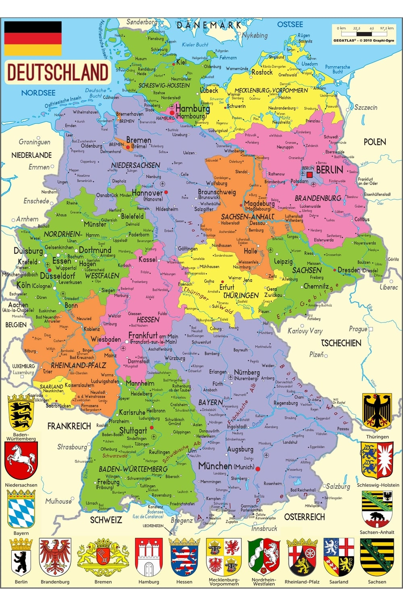
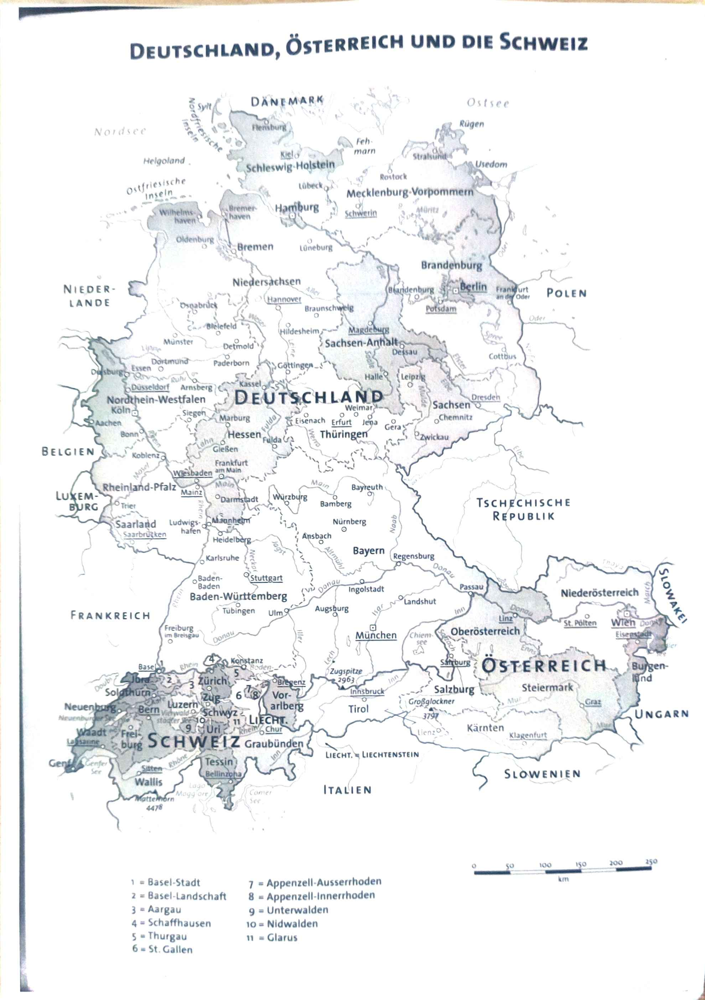
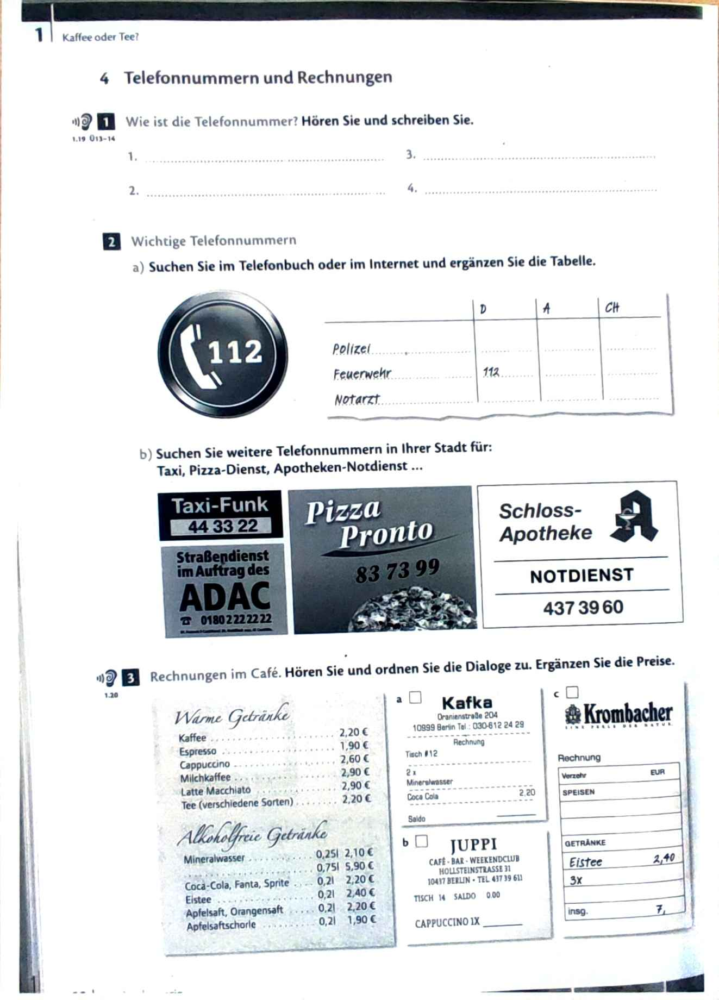
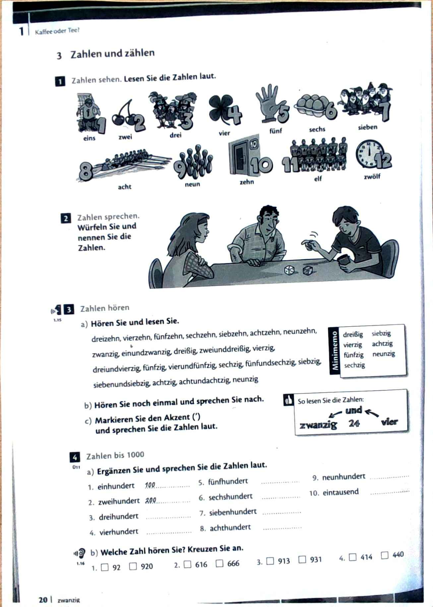

# Allemand
# 05 septembre 2024

### 3 genres :
* Neutre - das Datum(en) 
* Masculin - der Mann(er)
* Féminin - die Frau(en)
* Pluriel - die Frauen

### Das dautsche Alphabet
A - B - C (tssé) - D - E (é) - F - G (gué) - H (ha) - I - J (illot) - K - L - M - N - O - P - Q (cou) - R - S - T - U (ou) - V (fao) - W (vé) - X - Y (upsilon) - Z (tssèt)

Zoo: "tsso" // Zebra: "tssébra"

### Die Umlaut
* a : "a" 
* ä : "ai"
* o : "o"
* ö : "eu"
* u : "ou"
* ü : "u"

### Les diphtongues :

* ei/ai : "aiy" (die Polizei / mai / drei)
* eu : "oy" (Europa/Euro)
* au : "oiy" (grau (gris) / die Pause(n) (la pose) / Claudia)

## Exemples

1. die Polizei *(policier)* / der Polizist(en), die Polizistin(nen)
2. das Badezimmer(-) *(salle de bain)* / 
3. schwimmen : *(nager)* / das Schwimmbad(¨er)[1] [piscine] /der Schwimmer(-) / die Schwimmerin  
4. der Journalist(en) ("j" se prononce à la française) / die Journalistin
5. der Kindergarten(ä) / das Kind(er)
6. das Tranportmittel(-) (le moyen de transport)
7. das Vogelgesang(¨e) (le champ des oiseaux) / singen : der Sänger(-)
8. die Frisur(en) (la coiffure) / der Frisör(e)
9. der Finanzminister(-) / die Finanzministerin / der Kultusminister(-)
10. klassifizieren (classifier) / die Klassifikation(en)

[1]: on met le tréma sur la première lettre où c'est valide (a, o, u)  
**Ex:** die Stadt(¨e) -> die Stadt, die Städte 

----

* die Stadt(¨e) *(la ville)*
* die Haupstadt(¨e) *(la capitale)*
* sprechen(i) *(parler)*
* die Sprache(n) *(la langue)*

1. Glaz : Es liegt in österreich (ça se situe en Autriche)
2. Hamburg : Es liegt in Norddeutschland
3. Bern : Es liegt in der Schweiz (ça se situe en Suisse)
4. Berlin : Es liegt in Deustchland / die Haupstadt von Deutschland (la capitale de l'allemagne)
5. Frankfurt : Es liegt in Deutschland
6. Wien : Es liegt in Österreich / die Hauptstadt von Österreich
7. Genf : Es liegt in der Schweiz
8. Lugamo : Es liegt in Italien

Ich heiße ...
Ich wohne in ...

||||
|-|-|-|
| im Nordwesten | im Norden  | im Nordosten |
| im Westen     | im Zentrum | im Osten     |
| im Südwesten  | im Süden   | im Südesten  |
 
Titouan Martineau Westen  
Sylvain Fraresso Osten  
Gaël Jean-Albert Osten  
Tahina Dombrowski Osten  

die Schule(n)  
der Schüler(-)  
der Student(en)  
die Studentin(nen)  
studieren  

-> der Mitschüler(-)  
der Mitschdent(en)   

- er/sie heißt (il/elle s'appelle)  
- wohnt  
- Nachname (?) = nom de famille  
- Sein Name ist ... (masc)  
- Ihr Name ist ... (fem)   

sich vorstellen

- heißen   
- ich heiße  
- du heißt  
- er/sie/es heißt  
- wir heißen  
- ihr (vous pluriel quand on tutoie qqn) heißt   
- sie (ils/elles) heißen  
- Sie heißen

Wohnen

-----------------------------------------------------------------

DEVOIRS 
Réviser lexique

-----------------------------------------------------------------
# 19 septembre 2024

heißt / heißen 
- sein Vorname ist
- ihr Vorname ist 
- sein Familienname ist 
- ihr Familienname ist 
- wohnt in / wohnen
- lebt in / leben

Meine Midstudendt heißt ...

Mit Vornamen heißt er/sie [PRENOM]

En allemand, le verbe est toujours en deuxième place dans une déclaratve et dans une iterrogative partielle :  

### Phrase déclarative

Mit Vornamen heißt mein Mitstudent Nathanel  
Er heißt mit Vornamen Nathanel  
 
### Phrase interrogative partielle

Wo wohnt Sylvain ? Wo ? où : lieu où l'on est  
Wer wohnt im Norden von Toulouse ? Wer ? qui  
Wie heißt Sylvain mit Nachnamen ?   
Was ist Gabriels Nachname ? Was Que/qu'est-ce que   

### Première place

Können Sie wiederholen ? wiederholen : répéter  
Wohnt Oscar im Zentrum von Toulouse ?  

### Phrase injonctive

Setzt euch ! asseyez vous   

### Les nombres : die Zahl(en)

| Nombre | Écriture |
|-|-|
| 1 | eins |
| 2 | zwei |
| 3 | drei |
| 4 | vier |
| 5 | fünf |
| 6 | sechs |
| 7 | seiben |
| 8 | acht |
| 9 | neun |
| 10 | zehn |
| 11 | elf |
| 12 | zwölf |
| 13 | dreizehn |
| 14 | vierzehn |
| 15 | fünfzehn |
| 16 | sechzehn |
| 17 | **siebzehn** ~~(siebenzehn)~~ |
| 18 | achtzehn |
| 19 | neunzehn |
| 20 | **zwanzig** |
| 30 | dreißig |
| 40 | viezig |
| 50 | fünfzig |
| 60 | sechzig |
| 70 | **siebzig** |
| 80 | achtzig |
| 90 | neunzig | 
| 100 | einhundert |

### test

> - 5 : fünf
> - 4 : fier
> - 2 : zwei 
> - 1 : eins
> - 6 : sechs
> - 7 : seiben
> - 3 : drei
> - 9 : neun
> - 8 : acht
> - 10 : zehn
> - 11 : elf
> - 12 : zwölf
> - 17 : siebzehn

### La date en allemand

das Jahn hat zwölf Monate :  

- Januar
- Februar
- März 
- April
- Mai
- Juni 
- Juli
- August
- September
- Oktober 
- November
- Dezember

Der Monat achtundzwanzig oder neunundzwanzig oder dreißig oder einunddreißig Tage. 

der Tag(e) : le jour  
die Woche hat sieben Tage :  
- Montag
- Dienstag
- Mittwoch  
- Donnerstag
- Freitag  
- Samstag
- Sonntag -> das Wochenende

die Woche(n) : la semaine  
das Ende : la fin   
Das Jahr hat dreihundertfünfundsechzig Tage.    
Das Jahr hat zweiundfünfzig Wochen.   
Ein Tag hat vierundzwanzig Stunden  
die Stunde(n) : l'heure dans la durée  
Eine Stende hat sechzig Minuten   
die Minute(n)

### Avoir et être

| haben : avoir | sein : être |
|-|-|
| Ich habe | Ich bin |
| Du hast | Du bist |
| Er, sie, es hat | Er, sie, es ist |
| Wir haben | Wir sind |
| Ihr habt | Ihr seid |
| Sie, sie haben | Sie, sie sind |

### Adjectifs numéraux

On utilise des adjectifs numéraux ordinaux :  
Les adjectifs ordinaux :    
- de 1 à 19, on rajoute te(n)  
- À partir de 20, on rajoute ste(n)  

Il y a trois exceptions :  
- Erst(en) : le premier
- dritt(en) : le troisième  
- siebt(en) : le septième

#### Exo
Heute haven wir Donnerstag, den neunzehnten September 2024.
|||
|-|-|
| Mardi 25 décembre 1567 | Dienstag, den funfundzwanzigsten Dezember fünfzehnhundertsiebenundsechzig |
| Jeudi 15 novembre 1879 | Donnerstag, den 15. November |
| Mercredi 17 janvier 1976 |  |
| Lundi 28 octobre 1324 |  |
| Vendredi 18 février 2035 |  |
| Samedi trois avril 1876 |  |

  
"FUNFZEHN HUNDERT" -Toad

--------------------------------------------
DEVOIRS : voir email

--------------------------------------------

# 26 septembre 2024

Welchen Tag haben wir heute ?

Heute haben wir Donnerstag, den 26 September

Welchen Tag hatten wir gestern ?

Gestern hatten wir Mittwoch, den 25 September 

die Familie(n)

das Mitglied(er): le membre

|Allemand | Français |
|-|-|
| der Großvater / die Großmutter (die Großeltern) | |
| der Vater(ä) / die Mutter(¨) (die Eltern) | |
| das Kind(er) : der Sohn(¨e)/die Tochter | |
| die Bruder(¨) / die Schwester(n) / das Einzelkind(er) | |
| | |
| | |
| | |
| der Onkel(-) / die Tante(n) | |
| der Neffe(n) / der Nichte(n) | |
| der Cousin(s) / die Kusinen | |
| | |
| | |
| | |
| der Ehemann(¨er) / die Ehefreu(en)| le mari / l'épouse |
| die Ehe(n) : le coupe | le couple |
| der Schwäger(-) / die Schwägerin | le beau-père / la belle-mère |
| der Schwiegersohn / die Schweiegertochter | le gendre / ma belle-sœur |
| | |
| | |
| | |
| die Patchwork Familier[*] | |
| der Stiefwater / die Stiefmutter| |
| der Halbruder / die Halscwester| |
| | |

> \* (ChatGPT) En allemand, "die Patchwork-Familie" désigne une famille recomposée. C'est une famille formée par deux personnes, souvent après une séparation ou un divorce, qui ont déjà des enfants issus d'une relation précédente et qui vivent ensemble, parfois en ayant des enfants en commun. Le terme "Patchwork" fait référence à un assemblage de différentes parties, comme les familles recomposées où les membres proviennent de plusieurs familles précédentes.

| Namen | Vorname | Mitglied | Wohnort | Geburtsort | Alter | Geburstag |
|-|-|-|-|-|-|-|
| Frau Cazenave | Edmonde heißen | Mutter | In der Nähe won Paris wohnen | Nancy im Osten von Frankreich | 82 | 25/10 |
| Titouan | Dominique heißen | Mutter | Pibrac Im Südwesten von Toulouse wohnen | In Gimont sboren sein | 62 Jahre alt sein | am 31/08 Geburstag haben |
|-|-|-|-|-|-|  |
| Olexandra | Konstanin | Vater |-| 12 April | 52 j a | Ukraine Tszharnihiv |
| ? | Leane | V | Residence du touche | 17 September | 23 Jahre alt | Clamargue ??? |

**In** Poitiers // **Im** *den* (...)

### Vokabeln

* Die Geburt(en) : la naissance
* der Geburtsort(e) : le lieu de naissance 
* der Ort(e) : le lieu 
* das Geburtsdatum(en) : la date de naissance 
* der Geburtstag(e) : l'anniversaire
* gebären : mettre au monde  
  

>  

### Vor/stellen : présenter (verbe à particule séparable)
* Ich stelle meine Scwester vor 
* du stellst dein Schwester vor
* er stellt seine Schwester vor 
* sie stellt ihre Schwester vor
* wir stellen unsere Schwester vor 
* ihr stellte eure Schwerser vor 
* Sie stellen ihre Schwester vor 
* Sie stellen Ihre Schwester vor 

- Wer stellst du vor ? 
- Wie heißt er/sie ?
- Wo wohnt sie/er ?
- Wo ist er/sie geboren ?
- Wie alt ist sie/er ? ("how old are you")
- Wann hat er/sie Geburtstag ?

| | | |
|-|-|-|
| Namen | | |
| Herkunft (origine) | | |
| Sprachen | | |
| Lernsprachen | | |

Lernen  
die Lerne: l'apprentissage  
die Insel(n): l'île  
kommen: venir  
die Pyräneen : les Pyrénéens  
die Niederland : les Pays Bas   
die Vereinigten Staaten : les États Unis   
das Land(ër) : les pays/la région   
das Bundesland(¨er) : la région  

Woher kommst du?  
Wo bist du geboren?   

-------------------------
# 10 Octobre 2024

donnerKebab und thé

pierro wohne in leibzig  pizza eiß  italien  

madeli hanofer komme aus franreich  baguette & croissant

wohne im bremen  fish & chips  john miller ?

veronika  tanse hip hop & flamenco  spanien   wohne in wien

natalia  matrioscas  singen / aus rosland lubech 

Multimulti in Dachländern  
In welchem Dungesland liegt Dresden?  
Welche Grenzländer liegen in der Nähe?

Die erste Person
- Chem heißen 
- aus der Türkey kommen/in der Türkei genoren sein
- in Dresden wohnen (Plen und die Tschechische Republik liegen in der Nähe von Dresden)
- Döner und Tee mögen 
  
Die zweite Person
- Pierro 
- aus Italien kommen 
- Pizza und Eis mögen 
- in Liepzig wohnen/in Sachsen/eine großen Universität

...

Die vierte Person
- John Miller
- aus London kommen
- in Bremen wohnen/in Niedersachsen liegen
- Fish and Chips mögen

Die fünfe Person
- Veronika
- aus Spanien kommen
- in Wien wohnen/in österreich liegen/die Hauptstadt von österrejcb sein/in der Nähe von der Slowakei und von Ungarn liegen/an der Donau liegen 
- Sigmund Freud / Stefan Sweig / Franz Josef in Wien geboren sein
- Walzer mögen / gern Hip-hop und Flamenco tanzen

Die sechste PErson
- NAtalia 
- in Russland geboren sein
- in Lübeck wohnen / in Schleswig Holstein liegen / an der Ostsee liegen
  
Klassenspaziergang
Sacha
- Studium
- Was studierst du? Wie lange studierst du? (How long?)
  - Informatik (2 Jahre) 
- Sprachen/Was? Welche Sprache kannst du?
  - Englisch, Russisch, Ukrainisch
- Größe: Wie groß bist du?
  - 1 meter 64
- Was isst du gern?
  - Pizza
- Was machst du gern
  - Ich esse gern
  
Sylvain
- Was studierst du? Wie lange studierst du? (How long?)
  - Mathematik und Informatik (2 Jahre)
- Sprachen/Was? Welche Sprache kannst du?
  - Französich, und Englisch ein bisschen Deutsch
- Größe: Wie groß bist du?
  - 1m85
- Was isst du gern?
  - Ich esse gern Baguette und Croissant und Chocolatine
- Was machst du gern
  - Ich lese gern Videospiel

Gael 
- Was studierst du? Wie lange studierst du? (How long?)
  - Mathematik un Informatik
  - 1 Jahre
- Sprachen/Was? Welche Sprache kannst du?
  - Französisch, Englisch, Spanisch
- Größe: Wie groß bist du?
  - 1 meter und 80
- Was isst du gern?
  - Hamburger
- Was machst du gern
  - Videospielen
  
# 17 Octobre 2024

- Ich fahre gern Rad
- Du fährst gern Rad
- Er, sie, es hährt gern Rad
- Wir fahren gern Rad
- Ihr fahrt gern Rad
- Sie, sie fahren gern Rad

|Namen | Studium | Sprachen | GrÖße | Essen | Hobbies |
|-|--|-|-|-|-|
|Gael |  Mathe un Informatik an der Uni seit zwei Jahren | Französisch Spaninsch Englisch sprechen(i) Deutsch lernen | 1.80 groß sein | Schokolade | Sport machen gern klettern / im Klettersaal Rad fahren(ä) ins Fitnessstudio gehen |
| Oscar | Informatik seit zwei Jahren studiern | Spanisch, Enslisch? Französisch sprechen(i) | 1.75 groß sein | gern Sushis und Pasta essen | gern schwimmen gern Bowling spielen alle wei <...> |
| Léo | Mathe und Informatik | Französisch, Chinesisch (?) und Englisch | 

- Wo?
- Was?
- Wie groß?
- Wie oft?
- Welche Sprache?
- Wie lange? (depuis cb de temps?) 
- Wie hoch? (how high?)
- Wie viel? (how much?)
- einmal pro Woche / pro Monat 
- zweimal
- ab und zu: de temps en temps
- selten: rarement
- regelmäßig: régulièrement
- jeden Mittwoch / jeden Tag: tous les mercredis
- jeden Monat
- alle zwei Monate : tous les deux mois 
- im Chor singen: chanter dans une chorale
- allein/zusammen: seul/ensemble
- Freunde treffen(i): rencontrer des amis 
  - Ich treffe 
  - Du triffst 
  - ...
- Die künstliche Intelligenz: KI (intelligence artificielle)
- zeichnen: dessiner
  - ich zichne 
  - du zeichnest
  - er sie es zeichnet
  - wir zeichnen
  - ihr zeichnet
  - sie zeichnen 
- le dessin: die(?) zeichne
- Chemie
- Türkisch
- reiten:
  - ich reite 
  - du reitest 
  - er sie es reitet 
  - wir reiten
  - ihn reitet 
  - Sie sie reiten
- laufen(ä): courir 
  - ich laufe 
  - du läufst 
  - er sie es läuft 
  - wir laufen
  - ihn lauft
  - sie, sie laufen

.
- Name 

--- 
CONTROLE + remplir la feuille

# 24 Octobre 2024

- Welchen Tag haben wir heute?
- Heute haben wir Donnerstag, den 24 Oktober
  
Temps :
- Vorgestern
- Gerten
- Heute: Aujourd'hui
- Morgen
- übermorgen

Années:
- 19xx : neunzehn**hundert**neunundneunzig
- 20xx : zwei**tausand**vierundzwanzig

.
- Gehen / Ich fahre Rad
- lernen: apprendre
- das Rémilienmitglied(er)
- Biologie(gué)
- Ski laufen(ä) / Ski fahren(ä)
- Ich fahre gern Rad
- Ich fahre gern Ski
- Natalia läuft gern Ski
- Natalia fährt gern Ski
- das Fahrrad(¨er) / die Fahrräder

.
- Von Beruf est sie
- Sie arbeitet abs
- produzieren
- Filme produzieren
- zwischen: entre
- Kleider kreieren 
- Schmuschstüdie (???? mal écrit je crois)
- Bikkinis
- der Schaspiler (l'acteur)
- der Top Model
- heiraten: épouser
- sich trennen: se séparer

s'entrainer
